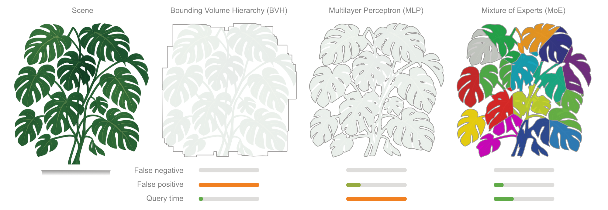

# Bounding Expert Hierarchies
> [Julius Überall](https://juliusuberall.com/)<sup>1</sup>, [Tobias Ritschel](https://www.homepages.ucl.ac.uk/~ucactri/)<sup>1,</sup><sup>2</sup> <br>
> <sup>1</sup> University College London, UK
<sup>2</sup> Meta Reality Labs, USA <br>
> Eurographics Symposium on Rendering (EGSR) 2026 <br>
> [Project page](https://juliusuberall.com/boundingExpertHierarchies.html) | [Paper](https://diglib.eg.org/items/e5d19c32-bd1f-405f-ba83-b7abb218b822) | [Presentation]()

Python/JAX implementation of Bounding Expert Hierarchies, using many small neural networks to represent and learn bounding volumes of 2D, 3D, 4D and 9D spaces. Using Mixture of Experts (MoE) the implict representation is distributed with a gate network and learnt by multiple expert neural networks such that they indiviudally learn a fraction of the scene and collectivly learn the entire scene.

<details>
  <summary><strong>Abstract</strong></summary>

We present a hierarchy of neural networks to perform bounding queries against geometric assets such as required in collision detection or ray-tracing. Using a mixture of experts, popularized in the context of large language models, we learn a space partitioning together with bounding volumes end-to-end. We demonstrate improvements in query speed and accuracy: instead of executing one monolithic network, only a subset of networks is evaluated, analogous to a bounding volume hierarchy traversal that visits only a fraction of internal nodes. This decomposes the global optimization objective into many smaller and simpler sub-problems distributed among all sub-networks. Unlike prior work, the space partitioning is not predefined and static (e.g. a grid), but emerges as a byproduct of the bounding optimization, allowing for non-trivial higher dimensional space partitioning tailored to the task. The benefit of using neural bounding queries is that they extend naturally to higher-dimensional domains such as time, configuration spaces, or robotic latent control spaces as we demonstrate. We discuss the design choices required for branched learning and execution and evaluate our approach against alternatives.
</details>


&nbsp;


## Getting Started
Download or simply clone this repository using the command line:
```
git clone https://github.com/juliusuberall/bounding-expert-hierarchies.git
```
The following steps are divided into collapsible sections.
<details>
<summary><strong>Repository Overview</strong></summary>
Below is an outline of our repository. Our Bounding Expert Hierarchy implementation is divided into adapter, core and styler.

```
bounding-expert-hierarchies/
│── .vscode/                  # Visual Studio Code Launch settings
│   ├── launch.json           # Task definition for full pipeline execution, debugging profiles and trainning data pre-processing pipelines
│── beh/                      # Our method implementation 
│   ├── adapter/              # Data sampling and loading to preprocess for training
│   ├── core/                 # Model implementations, training procedures and benchmarking
│   ├── styler/               # Result plotting and visualization
│── configs/...               # Stores YAML configurations for all dimensions including training hyperparameters and model architectures
│── data/...                  # Example data for 2D, 3D, 4D and 4D+ e.g. images, geometries and some samples as .npz 
│── scripts/                  # Two main pipeline scripts for training or sampling / pre-processing
│   ├── preprocess.py         # Preprocess data into correct pipeline format or sample for some dimensions
│   ├── train_evaluate.py     # Train models and evaluate for specified dimension
│── tools/                    # Additional tools like extracing mesh from .npz 3D samples
│── requirements-cuda.txt
│── requirements.txt
│── setup_venv.sh             # If CUDA detetced, CUDA requirements are installed as well
```    
</details>
<details>
  <summary><strong>Install Dependencies</strong></summary>

> *Tested on Ubuntu 24.04 with CUDA 12.6 / 13.1 and NVIDIA RTX 3090 GPU.*

Navigate to the root directory of the cloned reposiroty:
```bash
cd bounding-expert-hierarchies
```
Use the provided shell script to setup up the .venv python environment for the project, which will install all requirements that are fitting your machine. If run on a Linux machine with an NVIDIA GPU (`nvidia-smi` available), it additionally installs the CUDA-accelerated JAX backend from `requirements-cuda.txt`.
```
.\setup_venv.sh
```

</details>

<details>
  <summary><strong>Setup Result Logging</strong></summary>

The pipeline is expected to log all results in a google spreadsheet, storing benchmarking results and hyperparameters in an organized fashion. After the training and evaluation for a single model is finished, the pipeline will log its results on the spread.

To set a google spread up that the pipeline can log to, please follow these steps:
1. Go to [Google Cloud](https://cloud.google.com/?_gl=1*1476f49*_up*MQ..&gclid=Cj0KCQjwo_PRBhDNARIsAEcVALXrKij1JQc8TgrJecgvpq5KFQOpPjg7UpaySUBKbDEFBCKc3wjpK_saAhIREALw_wcB&gclsrc=aw.ds), log into your Google account and navigate to the [Google Cloud Console](https://console.cloud.google.com/?_gl=1*rpkkrb*_up*MQ..&gclid=Cj0KCQjwo_PRBhDNARIsAEcVALXrKij1JQc8TgrJecgvpq5KFQOpPjg7UpaySUBKbDEFBCKc3wjpK_saAhIREALw_wcB&gclsrc=aw.ds).
2. Create a new project.
3. Navigate to `APIs and services`. Click `API library`, search for Google Sheets API and enable it.
4. Navigate back to `APIs and services`. Click `Credentials` and click `Manage service accounts`. Now create a new service account and give it Editor permissions.
5. Select the new created service account, move to the `Keys` tab and add a new JSON key. This key will be downloaded and should be added to this project.
6. Now create a new Google Spreadsheet and make the sheet public accessible and that anyone can edit.
7. Copy the Google Sheet ID out of your sheets URL. Usually between one of the `/` within the URL.
8. Open the file `beh/gsheets_registry.py` and add the sheet `ID` in line 9 and the location to the JSON key in line 11. If you just create a new Google Spreadsheet you are good to go. However if you renamed the sheet, please update the worksheet name to log to in line 77.

Now you are ready to go and the pipeline will log the results to this sheet. Please check the name for each item that is beeing logged in the script itself.

</details>

<details>
  <summary><strong>Run Experiments</strong></summary>

### VS Code
The easiest way is simply using our pre-defined launch and debugging profiles for Visual Studio Code to run the experiments or trace any arising issues.

### Local terminal
Use our `run_exp.sh` script to run the experiment for 2D point queries for all 5 scenes. This includes training and evaluation, which will take a while depending on your hardware.

### Output
As we use the 2D scenes for demonstration, the expected output of the training and evaluation is (i) the metrics logged on the Google Spread, (ii) a plot that highlights the internal state of the MoE and (iii) a plot that compares the bounding across MLP, MoEG and MoE. All of these plots can be found in the `results/` directory which will be created when the pipeline runs. 
</details>

<details>
  <summary><strong>Scenes</strong></summary>

For demonstration purposes we provide our 2D scenes which are formatted as RGBA images. This allows to simply replace such with custom 2D scenes and running your own experiments.

Given that the training samples for higher dimensions are sampled in some cases in external software e.g. the robot state space described in the paper we excluded this in the codebase. If there is interest in the data for this feel free to reach out or sample yourself, since we simply formatted our data as a .npz file that holds queries and labels.
</details>

## Citation

```bibtex
@inproceedings{10.2312:sr.20261010,
  booktitle = {Rendering 2026 Industry Track},
  editor = {Gkioulekas, Ioannis and Jarabo, Adrian},
  title = {Bounding Expert Hierarchies},
  author = {J. Überall and T. Ritschel},
  year = {2026},
  publisher = {The Eurographics Association},
  ISSN = {1727-3463},
  ISBN = {978-3-03868-320-9},
  DOI = {10.2312/sr.20261010}
  }      
```
