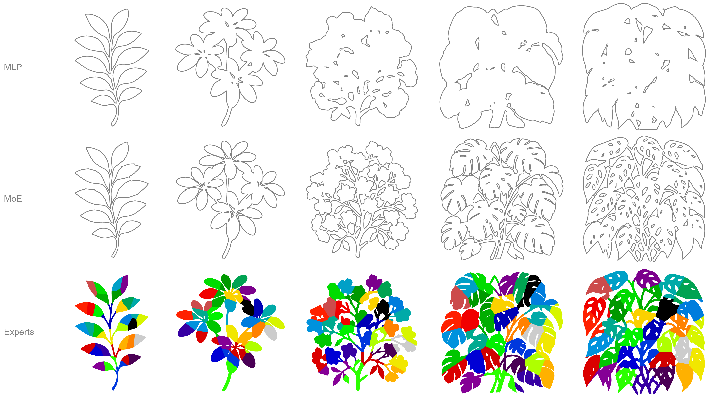

# Bounding Expert Hierarchies
> [Julius Überall](https://juliusuberall.com/), [Tobias Ritschel](https://www.homepages.ucl.ac.uk/~ucactri/) <br>
> University College London, UK
Meta Reality Labs, USA <br>
> September 2025 <br>
> [Project page]() | [Paper]() | [Video]() | [Presentation]() | [BibTeX]()

Python/JAX implementation of Bounding Expert Hierarchies, using neural networks to represent and learn bounding volumes of 2D, 3D, 4D and 4D+ spaces. Using Mixture of Experts (MoE) the implict representation is distributed with a gate network and learnt by multiple expert neural networks such that they indiviudally learn a fraction of the scene and collectivly learn the entire scene.



## Getting Started
Download or simply clone this repository using the command line:
```
git clone https://github.com/juliusuberall/bounding-expert-hierarchies.git
```
<details>
<summary><strong>Repository Overview</strong></summary>
Below is an outline of our repository. Our beh implementation, which is likley what you are looking for, is divided into adapter, core and styler.

```
bounding-expert-hierarchies/
│── .vscode/                  # Visual Studio Code Launch settings
│   ├── launch.json           # Task definition for full pipeline execution and debugging profiles
│── beh/                      # Our implementation 
│   ├── adapter/              # Data sampling and training data loading and preprocessing
│   ├── core/                 # Model implementations, training procedures and benchmarking
│   ├── styler/               # Result plotting and visualization
│── configs/...               # Stores YAML configurations for all dimensions including training hyperparameters and model architectures
│── data/...                  # Example data for 2D, 3D, 4D and 4D+ e.g. images, geometries, samples as .npz 
│── scripts/                  # All main scripts for execution
│   ├── preprocess.py         # Preprocess data into correct pipeline format or sample in 3D
│   ├── train_evaluate.py     # Train models and evaluate for specified dimension
│── tools/                    # Additional tools like extracing mesh from .npz 3D samples
│── requirements.txt          # pip environment freeze
```    
</details>
<details>
  <summary><strong>Install Dependencies</strong></summary>
  
Tested on Ubuntu 24.04 with CUDA 12.6 and NVIDIA RTX 3090 GPU.
&nbsp;<br>
> *The main dependencies are [JAX](https://docs.jax.dev/en/latest/index.html) and [Optax](https://optax.readthedocs.io/en/latest/).*

Navigate to the root directory of the cloned reposiroty:
```bash
cd bounding-expert-hierarchies
```
Use the provided shell script to setup up the .venv python environment for the project and install requirements.txt.
```
.\setup_venv.sh
```
This installs a CPU-compatible base environment that works on macOS and Linux. If run on a Linux machine with an NVIDIA GPU (`nvidia-smi` available), it additionally installs the CUDA-accelerated JAX backend from `requirements-cuda.txt`.
</details>

<details>
  <summary><strong>Run Experiments</strong></summary>

&nbsp;<br>
This section will focus on running the implemented experiments from the project. It introduces the experiment and implementation flow used in this repository and may help for setting up custom studies. 

### VS Code
The easiest way is simply using the pre-defined launch and debugging profiles to run the experiments or trace any arising issues. This is the workflow we useed when implementing our codebase and running the experiments.

### Local terminal
Check out our .vscode profiles shipped with this repo and invoke the python scripts with the respective arguments using shell.

### Google Spread Results Sync
The pipeline allows to store results in a google spreadsheet, storing benchmarking results and hyperparameters in an organized fahsion. If this is of interest for your workflows, check out the following file and add the required gspread api arguments for your spreadsheet.
```
beh/gsheets_registry.py
```
This synchronisation is called as a final procedure of an experiment for a single model.
</details>

## Data
<details>
  <summary><strong>2D</strong></summary>

&nbsp;<br>
We use RGBA images and all 2D data was produced using image generation models.
</details>

<details>
  <summary><strong>3D</strong></summary>

&nbsp;<br>
We use a collection of self-modeled meshes and other models from the web. We sample and preprocess those such into a .npz training data file with the experiment pipelines.
</details>

<details>
  <summary><strong>4D</strong></summary>

&nbsp;<br>
We did a fluid simulation in Blender and also sampled the mesh of such during each keyframe in Blender. We store positive and negative samples in .npy arrays for each frame and preprocess those into a joint .npz training data file with the experiment pipelines.
</details>

<details>
  <summary><strong>4D+</strong></summary>

&nbsp;<br>
We did a toolpath simualtion for a Universal Robot UR10 robot in Rhino3D and Grasshopper3D using the Robots plugin. For each simulation frame we store positive and negative samples in .txt file and preprocess those into a joint .npz training data file with the experiment pipelines.
</details>

## Citation

```bibtex
@article{something_interesting,
   author = {xxx, XXX},
   title = {xxx},
   booktitle = {xxx},
   year = {xxx},
   location = {xxx},
   publisher = {xxx},
   address = {xxx},
   pages = {xxx},
   doi = {xxx}
}
```
