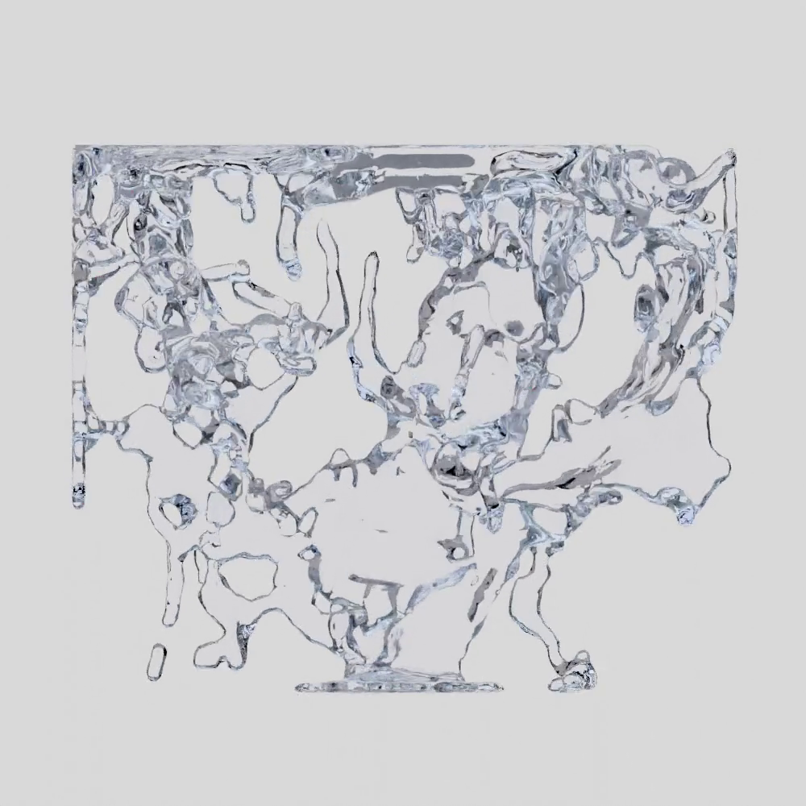
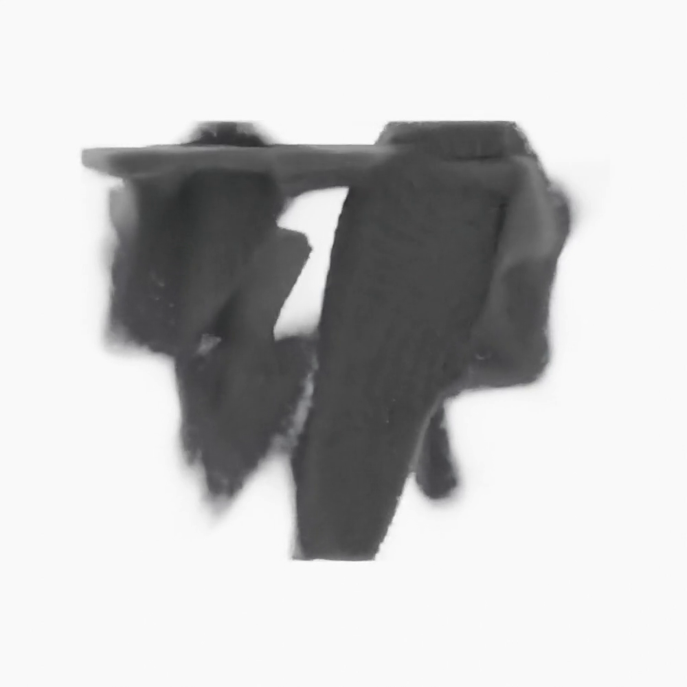

# Bounding Expert Hierarchies
> [Julius Überall](https://juliusuberall.com/), [Tobias Ritschel](https://www.homepages.ucl.ac.uk/~ucactri/) <br>
> University College London <br>
> X (__X__), September 2025 <br>
> [Project page]() | [Paper]() | [Video]() | [Presentation]() | [BibTeX]()

Python/JAX implementation of Bounding Expert Hierarchies, using neural networks to represent and learn bounding volumes of 2D, 3D, 4D and 4D+ spaces. Using Mixture of Experts (MoE) the data is distributed and learnt by multiple expert neural networks such that they indiviudally are learning only a part of the data and collectivly can reproduce all data.

  

## Repo structure

```
bounding-expert-hierarchies/
│── .gitignore
│── .vscode/                  # Visual Studio Code Launch settings
│   ├── launch.json           # Debugging profiles
│   ├── tasks.json            # Task definition for full pipeline execution
│── configs/                  # Stores YAML configurations for all model architectures
│── data/                     # Data to fit e.g. image, geometry, samples 
│   ├── 2D/...
│   ├── 3D/...
│   ├── 4D/...
│   ├── 4D_plus/...
│── docs/                     # Github and project page content 
│   ├── registry.py           # Central folder and structure declaration
│── requirements.txt
│── README.md 
│── scripts/                  # All main scripts for execution
│   ├── analyze_inference.py  # Analyzes inference of models e.g. speed, accuracy 
│   ├── format_results.py     # Processes and visualizes analysis results
│   ├── train_models.py       # Instantiates models and trains until saturation
│── src/                      # Core source code and python module 
    ├── dataloader.py         # Data loader 
    ├── moe.py                # Mixture of Experts (MoE) Implementation 
    ├── mlp.py                # Multilayer Perceptron (MLP) Implementation 
```

## Installation

How to get the enviornemnt up and running ?

## Usage

How to use my own data to test it with ?

## Data

4D fluid samples and 10D robot sample dataset description.

## Citation

```bibtex
@article{something_interesting,
    author = {xxx, XXX}
}
```
